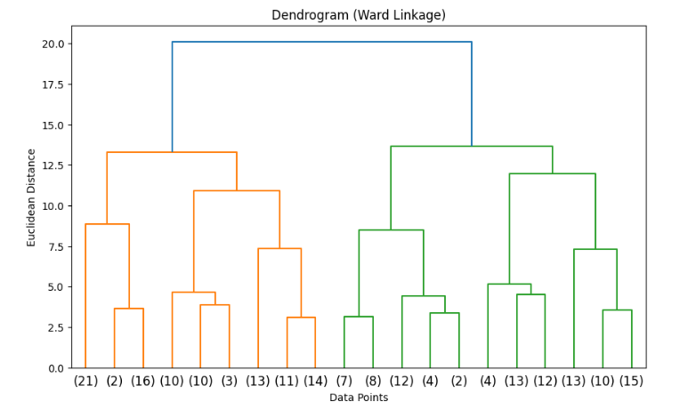
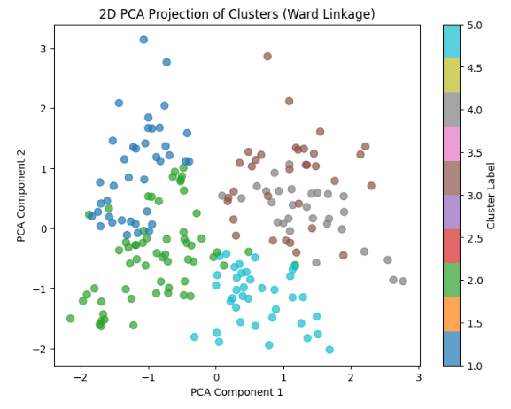
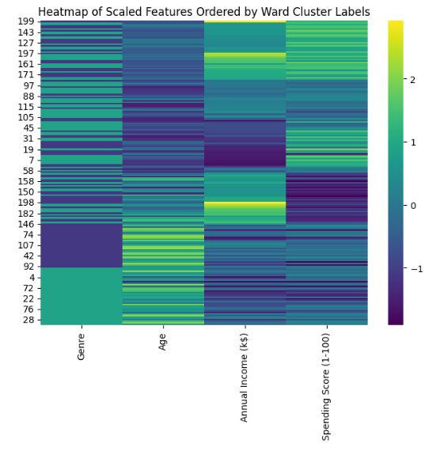
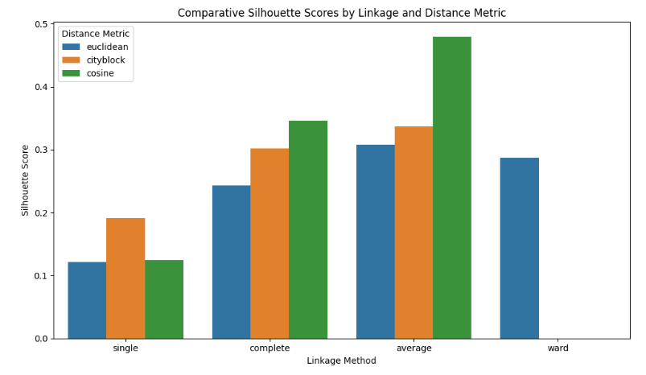

# Hierarchical Clustering on Mall Customer Data [](https://www.python.org/) [](https://scikit-learn.org/stable/) [](https://seaborn.pydata.org/) [](./LICENSE) [](https://jupyter.org/)

---

## 🚀 Live Results

You can view the notebook with all outputs and results on Kaggle:

[https://www.kaggle.com/code/evangelosgakias/hierarchical-clustering](https://www.kaggle.com/code/evangelosgakias/hierarchical-clustering)

All metrics, plots, and outputs are available in the linked Kaggle notebook for full transparency and reproducibility.

---

## 📑 Table of Contents
- [Live Results](#-live-results)
- [Table of Contents](#-table-of-contents)
- [Overview](#-overview)
- [Project Structure](#-project-structure)
- [Features](#-features)
- [Quickstart](#-quickstart)
- [Usage](#-usage)
- [Results](#-results)
- [Limitations and Future Work](#-limitations-and-future-work)
- [Contributing](#-contributing)
- [License](#-license)
- [Contact](#-contact)

---

## 📝 Overview

This project presents a comprehensive machine learning workflow for **Hierarchical Clustering** on the classic Mall Customers dataset. The notebook demonstrates:
- End-to-end data science best practices (EDA, preprocessing, clustering, evaluation, and interpretation)
- Professional documentation, accessibility, and reproducibility standards

**Goal:** Segment mall customers into meaningful groups based on their demographic and spending behavior, using hierarchical clustering and visualizing the results with dendrograms and other plots.

---

## 🏗️ Project Structure

```
Hierarchical Clustering/
├── Hier_Clust.ipynb   # Jupyter notebook with the complete implementation
├── requirements.txt   # Python dependencies
├── LICENSE            # MIT License file
├── README.md          # Project documentation (this file)
├── figures/           # Result images and plots
│   ├── dendogram.png
│   ├── pca_projection.png
│   ├── heatmap.png
│   └── silhouette_barplot.png
```

---

## 🚦 Features

### Data Preparation
- **Dataset Loading:** Uses the Mall Customers dataset (4 features, 200 samples, mixed types)
- **Exploratory Data Analysis (EDA):** Statistical summaries, pairplots, and feature correlation analysis
- **Preprocessing:**
  - Feature scaling (StandardScaler)
  - Categorical encoding (Genre)
  - Handling missing values

### Clustering & Evaluation
- **Hierarchical Clustering:**
  - Agglomerative approach (bottom-up)
  - Multiple linkage methods (single, complete, average, ward)
  - Multiple distance metrics (euclidean, manhattan, cosine)
  - Dendrogram visualization
- **Evaluation:**
  - Silhouette Score for cluster quality
  - Comparative study of linkage/distance combinations

### Visualization & Analysis
- **Visualizations:**
  - Dendrograms
  - Pairplots and heatmaps
  - 2D PCA projection of clusters
  - Comparative barplots of silhouette scores
- **Interpretation:**
  - Discussion of cluster structure and business implications

---

## ⚡ Quickstart

1. **Kaggle (Recommended for Reproducibility):**
   - [Run the notebook on Kaggle](https://www.kaggle.com/code/evangelosgakias/hierarchical-clustering)
2. **Local:**
   - Clone the repo and run `Hier_Clust.ipynb` in Jupyter after installing requirements.

---

## 💻 Usage

1. **📥 Clone the repository:**
   ```bash
   git clone https://github.com/EvanGks/hierarchical-clustering-mall-customers.git
   cd hierarchical-clustering-mall-customers
   ```
2. **🔒 Create and activate a virtual environment:**
   - **Windows:**
     ```bash
     python -m venv .venv
     .venv\Scripts\activate
     ```
   - **macOS/Linux:**
     ```bash
     python3 -m venv .venv
     source .venv/bin/activate
     ```
3. **📦 Install dependencies:**
   ```bash
   pip install -r requirements.txt
   ```
4. **🚀 Launch Jupyter Notebook:**
   ```bash
   jupyter notebook Hier_Clust.ipynb
   ```
5. **▶️ Run all cells** to reproduce the analysis and results.

**🛠️ Troubleshooting:**
- If you encounter missing package errors, ensure your Python environment is activated and up to date.
- For best reproducibility, use the provided Kaggle link.

---

## 📊 Results

### Model Metrics
- **Silhouette Scores:**
  - The clustering quality was evaluated using the Silhouette Score for each combination of linkage method and distance metric.
  - The best performance was achieved with **Average linkage + Cosine distance**, yielding a silhouette score of **0.479**.

| Linkage Method | Distance Metric | Silhouette Score |
|---------------|----------------|-----------------|
| single        | euclidean      | 0.122           |
| single        | cityblock      | 0.191           |
| single        | cosine         | 0.124           |
| complete      | euclidean      | 0.243           |
| complete      | cityblock      | 0.302           |
| complete      | cosine         | 0.346           |
| average       | euclidean      | 0.307           |
| average       | cityblock      | 0.337           |
| average       | cosine         | 0.479           |
| ward          | euclidean      | 0.287           |

### Visualizations
- **Dendrograms:**
  - Hierarchical structure of clusters visualized using dendrograms (e.g., Ward linkage).
  - 
- **2D PCA Projection:**
  - Scatter plot of clusters in 2D PCA space, colored by cluster label.
  - 
- **Heatmap:**
  - Heatmap of scaled features, ordered by cluster label, to visualize feature patterns within clusters.
  - 
- **Comparative Barplot:**
  - Barplot comparing silhouette scores for different linkage and distance metric combinations.
  - 

### Key Findings
- The optimal number of clusters was determined to be **~5** based on dendrogram analysis.
- The best clustering configuration (average linkage + cosine distance) provided well-separated and cohesive clusters, as shown by the silhouette score and PCA visualization.
- Feature patterns within clusters can be observed in the heatmap, supporting meaningful segmentation.

*For full details, metrics, and plots, see the [notebook](https://www.kaggle.com/code/evangelosgakias/hierarchical-clustering).*

---

## 📝 Limitations and Future Work

- **Scalability:** Hierarchical clustering can be computationally expensive for large datasets
- **Distance Metric Sensitivity:** Results can vary significantly with different metrics
- **Subjectivity in Cluster Selection:** Dendrogram cut-off is often subjective
- **Potential Improvements:**
  - Automate optimal cluster selection
  - Compare with other clustering algorithms (e.g., K-means, DBSCAN)
  - Advanced feature engineering
  - Deploy as a web app for interactive exploration

---

## 🤝 Contributing

Contributions are welcome! Please feel free to submit a Pull Request. For major changes, please open an issue first to discuss what you would like to change.

---

## 📝 License

This project is licensed under the MIT License. See the [LICENSE](./LICENSE) file for details.

---

## 📬 Contact

For questions or feedback, please reach out via:
- **GitHub:** [EvanGks](https://github.com/EvanGks)
- **X (Twitter):** [@Evan6471133782](https://x.com/Evan6471133782)
- **Kaggle:** [evangelosgakias](https://www.kaggle.com/evangelosgakias)
- **Email:** [vgakias_@hotmail.com](mailto:vgakias_@hotmail.com)

---

Happy Clustering! 
